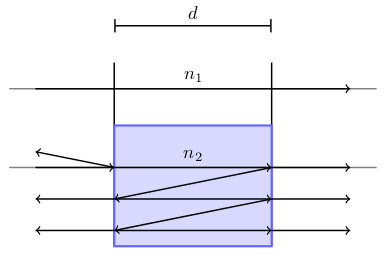

# Spectrum
Uma aplicação python voltada para detecção de por THz-TDS (TeraHertz Time-Domain Spectroscopy)

## Table Of Contents
- [Spectrum](#spectrum)
  - [Table Of Contents](#table-of-contents)
  - [Brief Introduction](#brief-introduction)
    - [THz-TDS (TeraHertz Time Domain Spectroscopy)](#thz-tds-terahertz-time-domain-spectroscopy)
    - [Newton-Raphson Method](#newton-raphson-method)
  - [Informations](#informations)
  - [Input Files](#input-files)
    - [File Example](#file-example)
    - [Json File](#json-file)
    - [Output File](#output-file)
  - [References](#references)

## Brief Introduction

### THz-TDS (TeraHertz Time Domain Spectroscopy)


### Newton-Raphson Method
The Newton-Raphson method is used to find a function's root. It 
## Informations 
$$
(n,k) \to T_c \to T_m \to \delta \to \text{new} (n,k) 
$$ 
Before proceeding we assume first the default units to be used as follows

| Dimension | Unit              |
| --------- | ----------------- |
| Time      | pico-seconds (ps) |
| Frequency | Tera-hertz (THz)  |
| Length    | micro-meters (μm) |

## Input Files
The input is data is as follows, the first column has the time data in pico-seconds and the second column has the amplitude data in arbitrary-units.
### File Example
```txt 
0,000	0,008
0,083	0,015
0,167	0,005
0,250	-0,004
0,333	-0,002
0,417	0,004
0,500	-0,008
0,583	0,010
0,666	0,004
0,750	-0,010
0,833	0,006
0,916	0,012
1,000	0,001
1,083	-0,012
1,166	0,012
1,250	0,005
...     ...
```
### Json File
The json file has the information about the sample and the parameters that should be set.
```json
{
    "material": {
        "name": "material",                 // Material's name
        "thickness": 200,                   // Sample's thickness
        "sample": "sample.txt",             // File with sample data
        "reference": "reference.txt",       // File with reference data
        "time_step": 0.083,                 // Time step value
        "initial_refractive_index": [1,0]   // Initial guess refractive index
    },
    "configurations": {
        "max_num_of_iterations": 10
    }
}
```

### Output File
The output is a csv file with the input data and the calculated information, the columns follow the names in the following order:

| Info                                | Unit                   |
| ----------------------------------- | ---------------------- |
| **`time_sample`**                   | $[ps]$                 |
| **`amplitude_time_sample`**         | $[a.u.]$               |
| **`time_reference`**                | $[ps]$                 |
| **`amplitude_time_reference`**      | $[a.u.]$               |
| **`frequency_sample`**              | $[THz]$                |
| **`amplitude_frequency_sample`**    | $[a.u.]$               |
| **`frequency_reference`**           | $[THz]$                |
| **`amplitude_frequency_reference`** | $[a.u.]$               |
| **`dielectric_constant`**           | $[]$                   |
| **`absorption_coefficient`**        | $[cm^{-1}]$            |
| **`conductivity`**                  | $[\Omega^{-1}cm^{-1}]$ |


[[1]](#1)
## References
<a id="1">[1]</a> 

